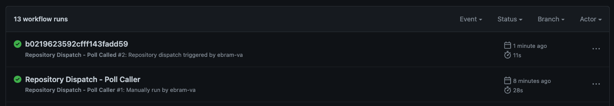

# Advanced GitHub Actions - Tips & Tricks

GitHub Actions is a CI/CD tool that is in active development by GitHub.  Because of this, while it is very easy to get started, it can sometimes be challenging to sift through outdated StackOverflow articles to do a specific thing, if you even know it exists!  While the GitHub Actions documentation is fantastic, you have to know what's there and what's been added since you've looked last.

This post attempts to resolve the issue by existing as a living document that gathers advanced features and explanations all in one place.  Our team follows the GitHub Actions RSS feed to always be looped into the new features coming out.  By knowing what's possible and how to achieve it, your CI/CD workflows will reach their greatest potential :muscle:.

# Table of Contents
- [Workflow Dispatch - Manual Triggering of Workflows](#workflow-dispatch---manual-triggering-of-workflows)
    - [Example](#example)
- [Repository Dispatch - Triggering Another Workflow](#repository-dispatch---triggering-another-workflow)
    - [Example](#example-1)
- [Repository Dispatch - Polling for Run](#repository-dispatch---polling-for-run)
- [Custom Actions vs Reusable Workflows](#custom-actions-vs-reusable-workflows)
- [Pausing a Pipeline - Manual Approval](#pausing-a-pipeline---manual-approval)
- [Matrix](#matrix)

## Workflow Dispatch - Manual Triggering of Workflows

This is the simplest example here, and is really only included because the naming is a bit weird.  A `workflow_dispatch` trigger is a manual trigger--the easiest way to manually kick off a workflow from the GitHub interface.

After adding the `workflow_dispatch` trigger to your workflow, trigger your workflow by navigating to:

- Your GitHub Repository main page
- Click the "Actions" tab
- On the left bar, select the name of your workflow
- On the right side, there is a button `Run workflow` that allows you to trigger your workflow.

### Additional Inputs
If you want to get even more enlightened, check out other options that go along with  `workflow_dispatch`, such as adding `inputs` in the [GitHub documentation](https://docs.github.com/en/actions/using-workflows/events-that-trigger-workflows#workflow_dispatch).

A great thing to note is that there is a default dropdown that appears, allowing you to select the branch to run from.  GitHub Actions only knows about workflows that exist in the `default branch`.  So if you're developing a new workflow on a feature branch and you want to manually trigger it, you'll find that the workflow doesn't show up on the Actions page!

There are a couple ways around this:

- Change the `default branch` to the feature branch you are working on
- Start by creating a very simple workflow, similar to the example below, and getting that merged into your `default branch`, before actually developing the workflow

We generally prefer the second option.  Once the simple "Hello World" workflow is on the `default branch`, you can continue developing on your feature branch use the `workflow_dispatch` to trigger your updated code on the feature branch whenever you want using the dropdown!

### Example

Check [this](./.github/workflows/workflow_dispatch.yaml) workflow out for an example of creating a `workflow_dispatch`.

## Repository Dispatch - Triggering Another Workflow

You've learned a lot of the simple ways to trigger pipelines already:

- `push`
- `pull_request`
- `workflow_dispatch`

But what about linking pipelines--having one pipeline trigger another?  That is the job of a `repository_dispatch`, of which you can learn more about [here](https://docs.github.com/en/rest/repos/repos#create-a-repository-dispatch-event).
There are two parts to a `repository_dispatch` event:

1. Creating a trigger event
1. Listening for a trigger event

### Creating an Event

To create an event, the simplest way is to just execute an HTTP POST command via `curl`.  Here is the example that GitHub gives:

```bash
curl \
  -X POST \
  -H "Accept: application/vnd.github+json" \
  -H "Authorization: Bearer <YOUR-TOKEN>" \
  https://api.github.com/repos/OWNER/REPO/dispatches \
  -d '{"event_type":"on-demand-test","client_payload":{"unit":false,"integration":true}}'
```

See the linked GitHub documentation above for requirements on generating the token to replace `<YOUR-TOKEN>`.  Remember that the creator of this token must have privileges on the GitHub repository for which you'd like to trigger.

Note also the data (denoted by `-d` line) here.  There are two pieces of the `json` data:

1. `event_type` - this is the webhook (trigger) name.  Since you can have as many different `repository_dispatch` events as you want, differentiates them.  As you'll see in [listening for an event](#listening-for-an-event), a workflow can listen for as many `repository_dispatch` events as you wish.
2. `client_payload` - this is any data to send to the workflow you wish to trigger.  Often times, you'll want additional data to be sent such as results from the triggering pipeline.

### Listening for an Event

Listening for a `repository_dispatch` event is as simple as adding it to the `on:` block of a workflow.  You can listen for as many different dispatch events as you want, and handle them differently in your code.  See the working example below for inspiration!

### Example

Working code for this section:

- [Triggering a repository_dispatch](./.github/workflows/repository_dispatch_trigger.yaml)
- [Listening for a repository_dispatch](./.github/workflows/repository_dispatch_listener.yaml)

## Repository Dispatch - Polling for Run

One of the biggest features lacking in the GitHub Actions space today is centered around `repository_dispatch` events.  When a `repository_dispatch` is triggered via an API call, the response does not contain any return information, meaning that you as a developer have no way to know information including the success/failure/completion-time of the called workflow.  You could consider just getting all of the recent runs triggered, but you're very much in a race condition world!

Thanks to a newer feature GitHub Actions recently released, there is a viable workaround to this, although it's not pretty.  What unlocks this possibility is somewhat obscure, and that's [Dynamic names for workflow runs](https://github.blog/changelog/2022-09-26-github-actions-dynamic-names-for-workflow-runs/).  Here's how Dynamic names help us solve our problem:

- Caller workflow generates some unique name, such as a UUID
- Caller workflow passes the UUID to the called workflow via it's `client_payload` data when triggering the `repository_dispatch`
- Called workflow uses the syntax run-name: `${{ github.event.client_payload.id }}`, which dynamically names the workflow the UUID value.
- Caller, after triggering the `repository_dispatch`, now can poll the workflow runs to find one who's name is the UUID!
- Caller, once the workflow with the UUID is found, can either poll or use the GitHub CLI `gh run watch` to watch that run for it's completion results.

### Example

Working code for this section:

- [Triggering a repository_dispatch and polling](./.github/workflows/repository_dispatch_caller.yaml)
- [Listening for a repository_dispatch using a dynamic name](./.github/workflows/repository_dispatch_called.yaml)
- [Polling script](./.github/scripts/workflow-status.sh)

In the case of the example above, you can see a workflow get generated with a random ID:


## Custom Actions vs Reusable Workflows

## Pausing a Pipeline - Manual Approval

## Matrix
