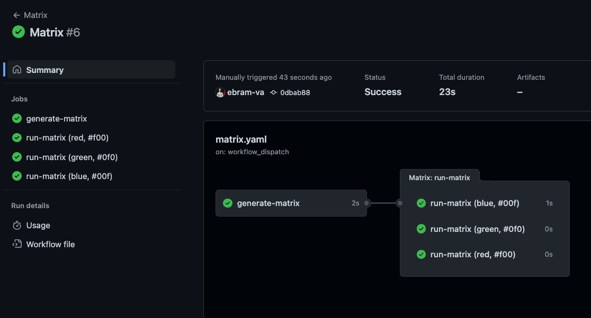

# Dynamic, Multi-dimensional Matrix
GitHub Actions uses the concept of a matrix run multiple instances of a job with different parameters.  As with the rest of this article, you should already be familiar with the basics of a [matrix job](https://docs.github.com/en/actions/using-jobs/using-a-matrix-for-your-jobs).  This section will detail some advanced usages you may not have realized are possible!

The documentation focuses heavily on static matrices, such as defining a list of hard-coded strings or integers in the pipeline and iterating the matrix over that.  However, the main power comes in the dynamic aspect of it.  They recently did add an example of using a `context` to define a matrix in [this example](https://docs.github.com/en/actions/using-jobs/using-a-matrix-for-your-jobs#example-using-contexts-to-create-matrices), but we can take it a step further!

What if we wanted a multi-dimensional matrix that was also dynamic?  Well, it's possible to define a job in the following manner:

```yaml
  run-matrix:
    runs-on: ubuntu-latest
    needs:
      - generate-matrix
    strategy:
      matrix: ${{ fromJSON(needs.generate-matrix.outputs.matrix) }}
```

Notice above, how we only define `matrix.strategy`, but do not define any key/value pairs under it.  Now, let's explore further into the steps on how you could use this:

```yaml
  run-matrix:
    runs-on: ubuntu-latest
    needs:
      - generate-matrix
    strategy:
      matrix: ${{ fromJSON(needs.generate-matrix.outputs.matrix) }}
    steps:
      - name: Print
        run: echo "The Color ${{ matrix.text_color }} is Hex ${{ matrix.hex_color }}.
```

Now you can see the power of this, which is it's ability to take in a fully dynamic array of objects and run a matrix against them.  There is one catch though, you must make sure you format the dynamic syntax properly.  When doing a multi-dimensional matrix, here is the following format:

```yaml
jobs:
  includes_only:
    runs-on: ubuntu-latest
    strategy:
      matrix:
        include:
          - site: "production"
            datacenter: "site-a"
          - site: "staging"
            datacenter: "site-b"

```

So if we want to do this dynamically, need to generate JSON exactly like:

```yaml
include:
  - site: "production"
  datacenter: "site-a"
  - site: "staging"
  datacenter: "site-b"
```

## Example

Here is a working example of a fully dynamic matrix:

- [Workflow](https://github.com/rise8-us/rise8-examples/blob/main/.github/workflows/matrix.yaml)

With the following results, a pipeline that ran 3 times for each of the colors:


And outputs inside each matrix job as follows:

